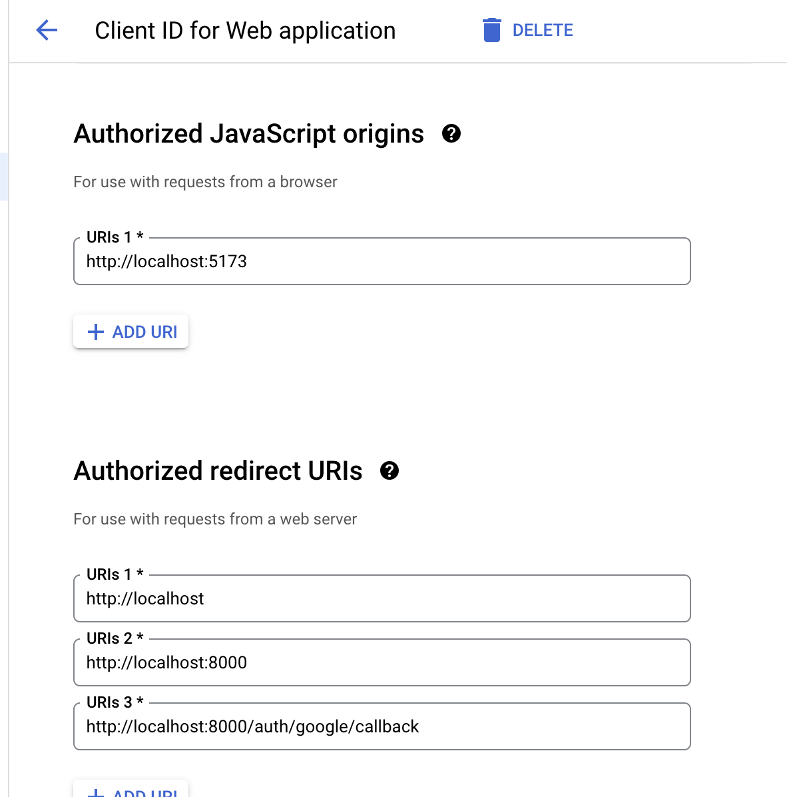

# How to use API while in development
When developing an application that requires our user data or updating it, you will need to run the code locally.

Refer to one of the sections depending on your situation
1) [Consumers](#getting-started-for-api-consumers) - If you are purely using a local copy of this API to develop a separate app
2) [Developers](#) - If you are actively developing in this repository

## Disclaimer
This API is currently only for internal use which is why there is no option for API keys to interact with the API in your own app. 

# Getting started for API consumers
You will need node and npm for this

1) Clone this repository
2) Enter the root directory
3) Create a `.env.production` file with the entries that are specified in `.env.example`
   1) You will need to create some of your own resources such as a Google Cloud App. You can refer to the [googlecloud](#google-cloud-app-setup) section
4) `npm run docker:dev` to start
   1) `npm run exitdocker:dev` to stop the server OR
   2) `npm run cleandocker:dev` to stop the server AND erase the persisting database
5) Go to `localhost:8000/docs` to view the documentation
6) **Ensure you `git pull origin main` often so that you get the latest changes. There is currently no autoupdate mechanism.

## Populating Data
Your local copy will have no data associated with it. You should 
1) Create your own user

# Google Cloud App Setup
Head to [https://support.google.com/cloud/answer/6158849?hl=en](https://support.google.com/cloud/answer/6158849?hl=en)

You should add the following URLs into redirect URL

You should also add the test gmail accounts you wish to use to create mock users. These will be the only users allowed to use your GAuth client.

