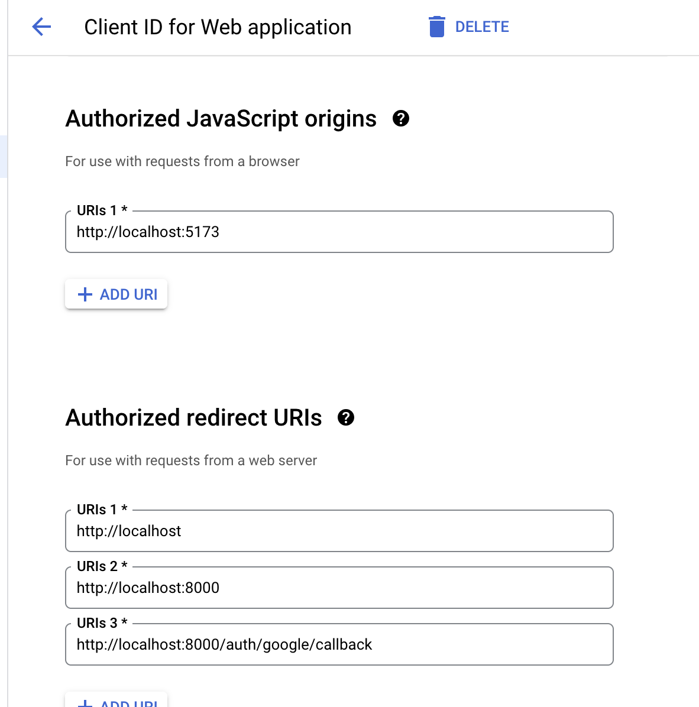
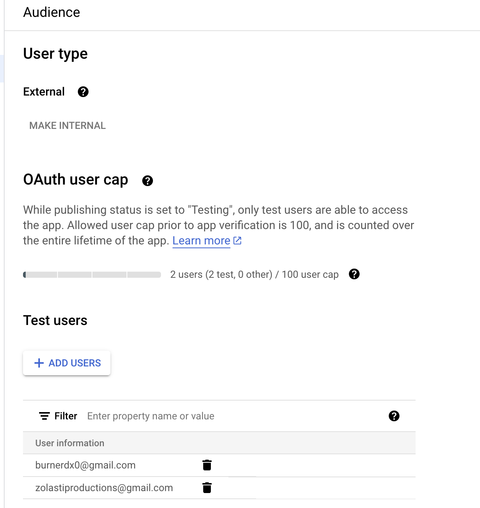
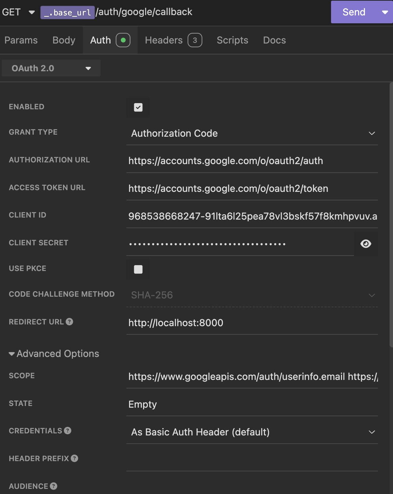

# Google Cloud App Setup

Head to [https://support.google.com/cloud/answer/6158849?hl=en](https://support.google.com/cloud/answer/6158849?hl=en) and follow the steps to create an OAuth client.

You should add the following URLs into redirect URL. You might need to add authorized Javascript origins such as where your NextJS app would run.

<!--  -->


You should also add the test gmail accounts you wish to use to create mock users. These will be the only users allowed to use your GAuth client.

<!--  -->


You can also find your Google Client ID and Secret on this portal when you create an OAuth Client

# GAuth with REST Clients such as Insomnia

In order to go through the OAuth flow with these in order to get the cookies for authorization, you can use the OAuth 2.0 authorization method hosted in these clients. This is a workaround and this is not how the API works in the browser. In reality, you would make a GET request to `/auth/google/login` which handles all of this for you.

The following is an example of an auth flow in these rest clients. In a browser like Chrome/Firefox, this flow is different since the user will be redirected to the google oauth servers on a GET to `/auth/google/login`. This workaround is useful for REST clients since they don't always support the OAuth flow from third-parties. This is also possible with Postman, albeit in a slightly different UI.

In principle, you need to generate your own authorization code from Google auth servers, which then gets sent to the callback as part of the Authorization header as a Bearer token.



You can use the following values here

```
Grant Type: Authorization Code

Authorization Url: https://accounts.google.com/o/oauth2/auth
https://accounts.google.com/o/oauth2/token

Access Token Url: https://accounts.google.com/o/oauth2/token

Client ID: <your google client id>

Client Secret: <your google client secret>

Redirect URL: http://localhost:8000

Scope: https://www.googleapis.com/auth/userinfo.email https://www.googleapis.com/auth/userinfo.profile

State: <anything you want>
```

Then click send, go through the Google Login process (making sure the email you use is added as a allowed user on the Google Cloud Console), and you should get a response of a successful login.
